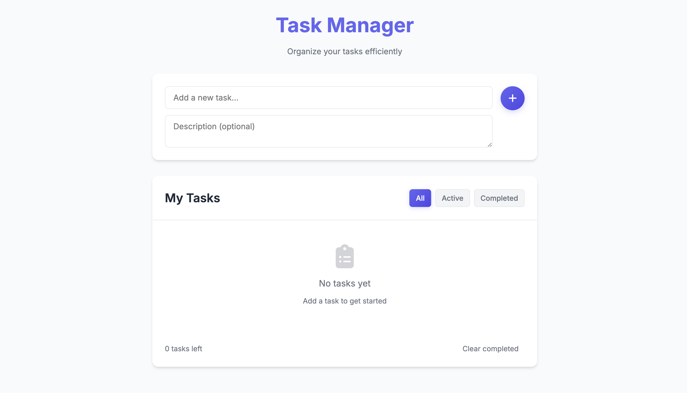

# Modern Task Manager

A sleek and responsive task management application built with HTML, CSS, and JavaScript.



## Features

- ✨ Clean, modern UI design
- 📱 Fully responsive layout
- ✅ Create, edit, and delete tasks
- 📝 Add optional descriptions to tasks
- 🔍 Filter tasks by status (All/Active/Completed)
- 💾 Local storage persistence
- 🎨 Modern color scheme with smooth transitions
- 🌓 Glass-morphism design elements

## Live Demo

Check out the live application [here](https://amit-mytodoapp.netlify.app/)

## Technologies Used

- HTML5
- CSS3 (with modern features like CSS Variables, Flexbox)
- Vanilla JavaScript
- Font Awesome Icons
- Google Fonts (Inter)

## Local Development

1. Clone the repository:
```bash
git clone https://github.com/amit-chaubey/to-do-app.git
cd to-do-app